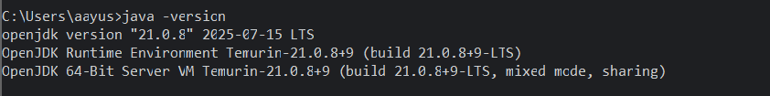
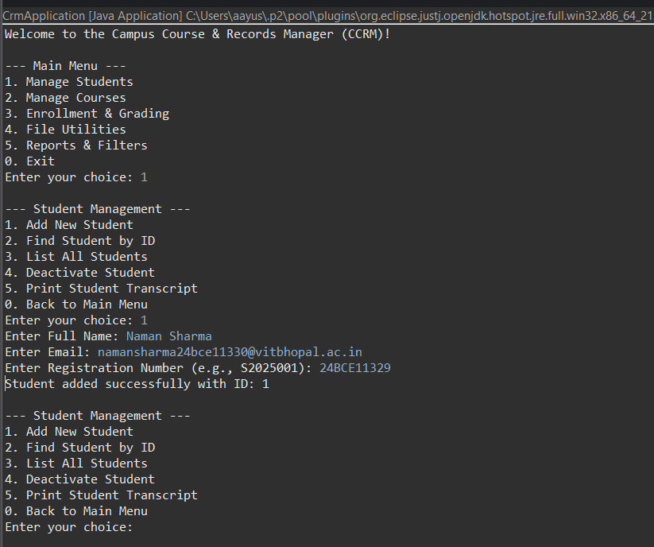

# CCRM
# Campus Course & Records Manager (CCRM)

## Introduction

The Campus Course & Records Manager (CCRM) is a comprehensive, console-based Java application designed to manage student and course records for an educational institution. It provides administrators with a simple and efficient way to handle student enrollments, track academic progress, manage course offerings, and generate essential reports. The application is built with a focus on clean architecture, separating data models, business logic, and user interface concerns.

---

#### Evolution of Java
* **1995:** Java 1.0 released by Sun Microsystems.
* **1998:** J2SE 1.2 released, introducing Swing, Collections framework.
* **2004:** J2SE 5.0 (Tiger) released, adding Generics, Enums, Annotations, and Autoboxing.
* **2014:** Java SE 8 released, a major update including Lambda Expressions, Stream API, and a new Date/Time API.
* **2021:** Java SE 17 released as a Long-Term Support (LTS) version.

#### Java ME vs SE vs EE
| Feature           | Java ME (Micro Edition)                             | Java SE (Standard Edition)                            | Java EE (Enterprise Edition)                             |
| ----------------- | --------------------------------------------------- | ----------------------------------------------------- | -------------------------------------------------------- |
| **Target** | Resource-constrained devices (mobiles, IoT)         | Desktop, server, and console applications             | Large-scale, distributed, and web-based applications     |
| **Core API** | A subset of the Java SE API with specific libraries.  | Core Java language and platform APIs.                 | Superset of Java SE's API with additional libraries.     |

#### Java Architecture: JDK, JRE, JVM
* **JVM (Java Virtual Machine):** An abstract machine that provides the runtime environment to execute Java bytecode. It is platform-dependent.
* **JRE (Java Runtime Environment):** A software package containing the JVM and core libraries. It is required to *run* Java applications.
* **JDK (Java Development Kit):** A superset of the JRE. It contains everything in the JRE plus development tools like the compiler (`javac`) and debugger. It is required to *develop* Java applications.

---

### Setup and Installation (Windows)

**1. JDK Installation**
   - Download the JDK installer for Windows from the official Oracle website or an open-source provider like Adoptium.
   - Run the installer and follow the on-screen instructions.
   - Configure the `JAVA_HOME` environment variable to point to the JDK installation directory (e.g., `C:\Program Files\Java\jdk-17`).
   - Add the JDK's `bin` directory to the system `Path` variable (e.g., `%JAVA_HOME%\bin`).

**2. Installation Verification**
   - Open a new Command Prompt and run `java -version`.
     
   

**3. Eclipse IDE Setup**
   - Download and install the "Eclipse IDE for Java Developers".
   - Create a new Java Project via `File -> New -> Java Project`.
     

---

## Key Features

* **Student Management**: Add, list, and deactivate student records using alphanumeric registration numbers.
* **Course Management**: Add, list, and delete courses, with advanced filtering by department or semester.
* **Enrollment System**: Enroll students in available courses, validating against duplicate enrollments and semester credit limits.
* **Grading System**: Record and update letter grades (S, A, B, etc.) for students in their enrolled courses.
* **Transcript Generation**: Automatically calculate a student's GPA and generate a fully formatted academic transcript.
* **Data Persistence**: All student, course, and enrollment data is automatically loaded from and saved to `.csv` files, ensuring data persists between sessions.
* **Reporting**: Generate useful administrative reports, such as a GPA distribution for all students or finding the first student enrolled in a specific department.
* **Data Backup**: Create timestamped backups of all `.csv` data files to a separate directory to prevent data loss.

---

## Project Structure

The project is organized into a standard Java package structure to ensure maintainability and separation of concerns.

CCRM/
│
├── data/             # Contains all CSV data files (students.csv, etc.)
│
├── backups/          # Stores timestamped backups of the data directory
│
├── bin/              # Stores the compiled Java bytecode (.class files)
│
└── src/              # Contains all Java source code (.java files)
└── edu/ccrm/
├── cli/      # Handles the command-line user interface (CrmApplication.java)
├── domain/   # Core data models (Student, Course, Grade, etc.)
├── exception/# Custom exception classes for business rules
├── io/       # Manages file input/output (Import_export_service, Backup_service)
├── service/  # Contains the application's business logic (Student_service, etc.)
├── screenshots/ # contains the screenshots of project
└── README.md

---

### How to Run
- **JDK Version:** Java SE 17 (or your version)
- **Compile & Run from Command Line:**
  - Navigate to the project's root directory.
  - Compile: `javac -d bin src/edu/ccrm/cli/CrmApplication.java` (Adjust paths as needed)
  - Run: `java -cp bin edu.ccrm.cli.CrmApplication`
- **Run from Eclipse:**
  - Import the project into Eclipse.
  - Right-click on `CrmApplication.java` in the Package Explorer.
  - Select `Run As -> Java Application`.

